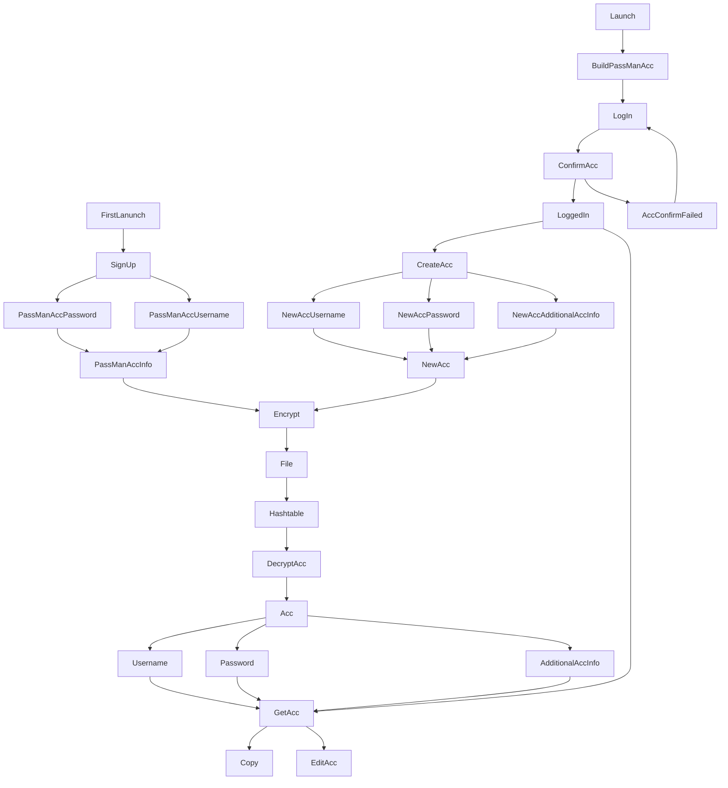

# Information Flow

# How the program flows

# Flow of information into system

1. A password for the password manager account. (Password manager is local and username will never really be asked but will be used for making the vault key better and likely used for UI as well)
2. New accounts and their info.

# Flow of information out of the system

1. Accounts and their info.

# What the system does with the information
1. When the user signs up for the service it will prompt them for a username and password. From there the program will add a salt to the password and finally make a vault key. The way a vault key is made is by appending the username, password, and the hostname along with the salt and using Password-Based Key Derivation Function 2 (PBKDF2) on that string. [Read more about it here in section 5.2](https://www.ietf.org/rfc/rfc2898.txt). The vault key and username will then be stored in an encrypted file along with a hashtable.
2. On log-in the user will be prompted to enter their password. This password will have all of the same things done to it as before to make a vault key the vault key will be compared with the one stored in the file and if they are the same the file and all of its information will be unlocked.
3. Now that the user has access to their vault they can do a few things. The first is create a new account to store in the vault. When the user asks to make a new account the program will ask for a few pieces of information the username, the password and anything other account information the user would like to store in their vault hash table.
4. The user can also ask to access the accounts stored in their vault. When they ask the computer will use the app/account name as a key to pull the account class details.
5. Once that has happened the user can then ask to copy either the password or the username and the program will automatically do that. The user can also ask to see the additional information which will then be presented in the terminal or to edit the account which will prompt the user for a username, password and additional information if the user doesn't want to change that part they can press enter and the program will then skip that change and go on to the next.